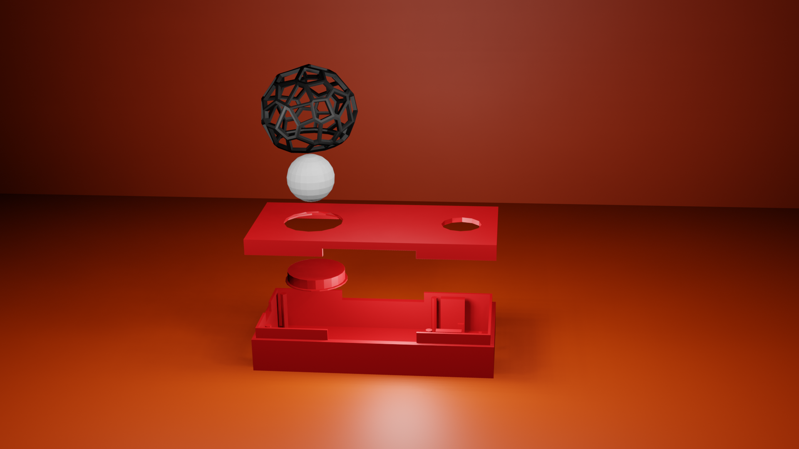

# Pocket Lamp


# Descrizione progetto

Questo progetto è una rivisitazione della ["Long Distance Friendship Lamp di John Harrison & Vanessa Whalen"](https://www.uncommongoods.com/blog/2017/john-harrison-vanessa-whalen/).

Le due lampade sono sempre connesse tra loro , ogni volta che si preme il pulsante della propria lampada, quella dell'altra persona si illuminerà.

# Componenti

- 2 x [ESP32 NodeMCU](https://www.az-delivery.de/it/products/esp32-developmentboard)

- 2 x [LED 5mm ](https://www.amazon.it/gp/product/B06X3VT6TD/ref=ppx_yo_dt_b_asin_title_o05_s01?ie=UTF8&psc=1)( 3.2V , 20mA )

- 2 x Resistenza ( 5Ω )

- 2 x Pulsante 12mm

- [STL Voronized Halloween Lampshade](https://www.thingiverse.com/thing:2613160) ( stampala con dimensioni del 20%)

# Assemblaggio



<p align="center">
  
</p>

- #### **Schema elettrico**
  
  
  
  **N.B**: il pulsante viene mantenuto in pull-down attraverso la resistenza interna del pin G5 ( vedi codice ).
  
  ```c
  pinMode(PULSANTE,INPUT_PULLDOWN);
  ```
  
  **calcolo resistenza R1**
  
    
  
    
  
    
  
    
  
    

# Programma

crea due Token blynk uno per lampada.

Token Blynk lampada 1 = "AAAA"

Token Blynk lampada 2 = "BBBB"

prima di caricare il programma nell'esp apporta le seguenti modifiche al codice di ogni lampada.

Ricorda: le lampade hanno le porte virtuali e il Token Blynk invertiti tra loro. 

- **lampada 1**
  
  imposta le porte virtuali:
  
  ```c
  #define VP_RICEZIONE V5
  #define VP_INVIO V6
  ```
  
  imposta i token: 
  
  ```c
  char auth[] = "AAAA";
  char esp32_slave[] = "BBBB";  
  ```
  
  imposta nome access point lampada:
  
  ```C
  char ssid[] = "nome_access_point";
  ```

- **lampada 2**
  
  imposta le porte virtuali:
  
  ```c
  #define VP_RICEZIONE V6
  #define VP_INVIO V5
  ```
  
  imposta i token:
  
  ```c
  char auth[] = "BBBB";
  char esp32_slave[] = "AAAA";    
  ```
  
  imposta nome access point lampada:
  
  ```C
  char ssid[] = "nome_access_point";
  ```

# Funzionamento

Le due lampade devono essere connesse al wifi .

Per la gestione della rete wifi si è usato la libreria "[WiFiManager](https://github.com/tzapu/WiFiManager)".

Per la comunicazione tra le due lampade si è usata la libreria "[Blynk](https://blynk.io/)", attraverso un [bridge](http://docs.blynk.cc/#widgets-other-bridge)  tra i Token di Blynk.

## [Link Grafo degli stati](https://app.diagrams.net/?lightbox=1&highlight=0000ff&edit=_blank&layers=1&nav=1&title=Untitled%20Diagram.drawio#R5V1bc5u6Fv41fqwHIRDwmKbt3pnZu%2BlMe3a7nzrYlh1OCfhgnEt%2F%2FREYMEiyEbEkFJKZzBiBuCyt9a2rpBm8vn%2F6Iwu3d3%2BnKxzPbGv1NIMfZrYNPRfNXfKjaHs%2BtAHbh4eWTRatqrZjw9foN64arap1H63wrnNhnqZxHm27jcs0SfAy77SFWZY%2Bdi9bp3H3qdtwg5mGr8swrlvrLyjav0er%2FK5qByg4nvgTR5u76uG%2BjQ4nFuHy1yZL90n1xCRN8OHMfVjfpvrK3V24Sh9bTfDjDF5naZofft0%2FXeO4oG1Ns7pf%2Fly%2F6Ay%2Bv8vvY3IAyM%2Fy9KcTnYFIZ%2FJdGU7y9uNO3e%2FJfh89%2FfM7vlr8WIfZj2%2FX25vrd%2F7hLg9hvK8fQj8Vrwipq8M0y%2B%2FSTZqE8cdj6%2FuSerh4jEWOjtf8labb6mX%2Fi%2FP8ueKbcJ%2Bn3U%2FZ5Vn6qxk3yP24mhzpPlviM19Us1%2BYbXB%2B5rrqQ4uvaz2gIt0fOL3HefZMLshwHObRQ5f9wopfN811TdcvaURe2bYq8XoH3KBig0q4bGh1b3J41arfcQDJj9aLHJvKYR0wxIAZ4jCO7gldwzzNCKtbt5%2BZMe%2BO6ONdlOOv27Ck%2ByMBke7oraM4vk7jNCv7wuUKL%2FxFM6qtMxDBAK7Oje4DznL8dHY8Groiy52DDmWdirCPLQCoZfCuJfvIOj2KHeoPJTUyUJrci6TJFpQmV4k0XWVZ%2BNy6YFvIyO6ssDmUsFkUKA7tQX4c3kKqTNoMo3z9%2BO0%2FX2Y2igmV3y8y8muTlyN3aNnHdEscdRgL%2FW9fqKH3RHzyd0TAN8kMXpErYrzOj2frm%2BwIA6UFS%2BzjXZjkuL4p%2BZjivvKfhML7AjWSxW5bniRXr9Q9NFwucbJKVT%2BmpuIifk5%2BqXsMsdcKKVD2FVucbERoRRrbbPgaVQa0KJXR6Ie2zvA4OgM4qpRGbUNPSGu4glojMEZruF1DAvVrjbM91GgNl2GUv25vv1wmiXLkChG56hLEDljBso%2Fip0m0nMmJViAoWgAqkS2OKBSgWjvT1eAjlxrRw2cxLg7vbnYw95zO3TxLzGG6XO4RHCr3VA81ck%2BeOoyPyxjGa2VcIJtxL4KQgKE8AcZoHS3TkvxhaQCWYa3dLmpCR%2BOiMeMYu1DQMw6UIbEZrjF%2BivIfRfe5Wx392zrz4am6c3nwXB3IFIIalfulQI1DzUM0t4tonieG3ZejrRfowE7IMB5Bx6PMpkN97q7rh4k%2FW9zrvgikLeOo4IhxfKi1v8TLJc%2BHWviE8pY6H6rRz30%2BlDp0MTGMfSFSiPpQwDNKX9aUf4tDYZtlugDWX4wL%2BpFuyTpKohLAwjzHu7B4p6hjxWgKROL1ukJSWFwT3m%2FxZhPNqmCURUAvWhWHBbzuk7AcwX35vvE%2B2YTqomIcK08oWCoR4Kt3%2FLAkHIuzERHfoRHfdzmIH%2BhEfHt6nn2TOO%2BFGemu%2FWVDYYZpP85QmJL3smHXtg68vkhGTw9FeS82GX1E1YsT0aYAJrS7KUUD4NIMA5kQNXv%2BUfUvDwr3u3LGi8OjB14eqXDBbWHDWpsLbnt0wAYAmhUUF4nYrK2Y4%2FttafZkjVHYMoEsrol4yPJWhpD17ePfX25%2Ffv74%2Fef3m083E5Ft2JVtYPljC3f9RlNSwKJxMlt6CvEynGWjTf1idBCagwiVjkqnVmKKQgQs8zwKOL3ARS0cvVIEzQpcwAl6FMJDId3quAzQ2PxXhiOCaLs8%2FE3QLCpFdh1NApcICInAEtIJS870Ah1Q1AJ3zAp0QNZGbjuvnz5NVAgCNLoQTE8hOKIWrmOWQnCn52yID4VZzobDOhvhw0OUli8QJRwdfSqpc2ypEkTrKCmTQ%2BR%2FeVeg2yFnXqv%2BtPeOktNE9Xe10%2B1dN6ko%2Bd7tCg44hEiUlZZXb%2FKIF%2BWkNDJG5PFXILDnAPlzp8DON5Ue8tngFS8k0kwV1KIwXDOcORPinY6o56Et3OlR4XGHrhaVVt9pWVSwDgR9aREUXNwF6qgFd1jHrMaY3TZMWnVK%2BwIyk336UGb5cWmsVuBNT8pJf7GNDW61bzsJ5AIAMNNBLF7ZOg%2B66Co5eVrdjFQNC0FHMDvi178d%2BOKD2QXQxYckYc9RPnY1xZENv9B8IAu7HP%2FEk07i0Ml3U4tDrFM8DHMweSfeDMEJAIzrs6bR6PgCTcWXl%2BMEFIUF%2BXHuU9JLGR6%2BKhMHUrOXfR011Y4h1vXIxfzibKfLtHYQCzieq4bzXMulnlQVTChlvZrmHLN3FT3U5ilVU9SYsK1LOL0UxS7YmttlGUw5VLhGxc%2F7dEVuk8%2Bu4ezKKjgq3WxiJsTBi8u0vvQQonmIcJlizqI43C2jg2o9EaQRiVDwaTcB5YygO7cpkAbzug6mrZ4Rd9aq783d0wJ6WdLNjBirCdGLenaDQdVaHruIgIUUgexhZjX%2FYWcCEkwnP9CAzfVYcfNjDJRNJV%2FGKY8nqnDsahbA6snjhLdLqE4ReeVif%2BXwiOzbC4iQLCI7lJ3r8ijscygMoCqUJr4cQ%2BODTpe8oNYqxP6ay8ho6ePFWlo4jIpjOh6HxnpnDXOmMJ3VhEZOfPcFVRjSpsLouLhNC4ks%2FRUwa9%2F16C66A9CiuDiaSwubtUKqFoCUleUHPXZWefQFZxH5%2FkIBSje%2BhDmXKDxtrGsHc2jZ0HZdH8DAhV3IskxlZFhNRFfKyAEb26s00qXGFm1brdc237ZaoQVypal9m07gccKnmlWSxVpWMqvAxiF04FLszSv50kpnNL0wNRKte0RmTelH5%2Bse5Rq7IzE84BX6amV4z4ygj1SGFw3e1It0G8Lwnv12h8IzayoIYi3zKDlU4CVpXqzQEL5G%2BPGcYB60%2FwwDI98MCTAhAl0LRK%2Fk%2BGZJjs8rEHvdICY8FPJB7IVFPK4z74p2Xetx0m90vOB8FzWeo8d6NecnrvLLBDmTwY%2FzWqv54Def%2F7m5%2Ffn59tvNp5vrK30l5NSa4KfKHCXXixPilTnfMs%2B7L%2FO%2BTD74RLU9L5VrRXF3GEZZak6PknSpgjbe%2Fg7NZhqdmD%2B9YKy81UB55QevG1R9UVCtjQ1T9NsU4zA2otEf8BJdPKanK8zk8Tw7zei183zNyv08bxvF8wEbI2C9oVKPFCvphatqXT%2F8gEupeIXy4J8yoHono6qTh4E5ydcgD9LZ%2FFT6xqGWz4H0XkzSEjbUc%2By%2BfE33%2Bv7l07wLO2iZJVQPbItXDytu7psFLX9Xpn1pFb9GhKBLXiFvOWKtCOFNb7q6%2FAjt6AjhoG4B80REHrFxH0mefHdZN9qNf33Q4TLGNn9yDq%2F6V2HJk0joNVldFbumkqNlHJIxXc64MyPq362o6cmZES%2BNtXYHWmrtr7Bn6guCU2tc3TMK4VIMY4pFfIpbhLfDCejNCQX3Dn3JArJUgaXn96EbpN9NS6mWSF2AAvHoQhG3AEwDpzc1p6awOgBUhQ6kkVF86yeLyslDel8wg5jd0bJ3CRiYwxmh%2FLWfZet31lAbSNlbjk9VA4rjLl0KTd9Jmpvq8x90%2Bs3oDo4O1B06I2kaBbICvK2v7lUabwMLdEtou7vtIddUVneRhhJawJ1hahbm9tsT4hxc6zVDItzNm2spNtQ0s4YuNuROXtJbxQwHJnWM5PKadwW4XLoNciH5WX3abMOtpK5NE6d7BnL6SFPIdMZg5EqVLSxVjhLrZ%2FgiKJS1Xm9pedKyoDs4rg4jGo40y2ws7kCGYa7NkL81OUpTFRpb%2FLUbuIyH5lovTYrDpW19nuLgBbIUKo6Rgi%2Bn1tlrzmlRAmg80%2BoEaNsUiyA6qi7LUWUe5PQk%2BuilkKgOqtQJm2V%2B9Z4SvZyZCfYjuwGDwjrDkejsjE%2FnGl17FrSlaa9geVozggQOr4xF85CIBAkEc23dRfoaz4frBilMKddfYEz%2BzGJckRfnz7RVzvh0cR3qUZDNDiKiHQBwhvYYpdgGCO1D3CMiCtldeF0ObexOKx56qsYU2B00Rfvi3Du8h2wJ4fSAdEZei0w5ZkyyeXmViCwfTE14jcev7tzyW7OR7e6ou%2BS06%2Fvkhx04TQWOwRJ7Prz3Voq%2FwdBts4wMOArvzgQM2ykLcPZnKifjKEvyYLByscfzVALkwVDaqkz0QoFo9NWCwNBdM8xkdeGtyR2zVggCnF0glE4u0cTpdBmYCYzOJpGULDqqicKegRSW4NK9xHZUX0hvjBdIFw0jutJX3KZkFq2lGePNFQ0bskPnRfUPTa5rhPoHR3SpLF3L9dKxAYdebV5cWiDtganavorxqN6mBya0D6XSyVzDcsgKdZCwbWuasqKjFh4tMwPEj8osNzthSldWzAZUQY8AMrG%2B4T3qhLxikZKRlHphnZ2ZZp2AuwgNkyk6eO2%2BPOvVeyuDDEBKDaqSEJE6Q%2BG0rUN0WJvbg8AbwO%2FFKXoGTls5Of4Q9aR8xXvxreANkyif3vwTvFiifJu%2BFZ2jkyVRHr3Hab3c%2B8l389D5HkMlihxmaVGgebw8C7d3f6crXFzxfw%3D%3D)


## **Istruzioni all'uso**

- **accensione:**
  <p> Quando si accenderà la lampada effettuerà 1 blink di notifica fine setup, seguta da vari blynk i quali indicano che sta cercando 	      	    di connettersi al wifi.<br>
      Finiti i vari blynk di setup se è tutto è andato a buon fine il led resterà spento.
  </b>

- **configurazione wifi:** 
  <p>
    Per effettuare la configurazione del wifi la lampada deve essere in modalità riconnessione.<br> 
    Si accede alla modalità riconnessione solo se la lampada non è connessa a nessuna rete.
  
    Quando la lampada è in modalità riconnessione effettuerà in <b> loop 3 blink rapidi e una pausa lunga </b> solo se è in questa modalità potrà essere riconfigurata la connessione wifi.<br>
    Per riconfigurare il wifi basterà <b> tenere premuto il pulsante per 30 secondi</b>.<br>
    Passati i 30 secondi di pressione del pulsante il led effettuerà dei blink ,<b>al rilascio del pulsante il led resterà acceso fisso</b>.
    <b>Collegati all'access point della lampada all'indirizzo 192.168.4.1</b> e imposta l'ssid e la pass della rete a cui si dovrà 		connettere.<br>
    Finita la configurazione del wifi si riavvierà (vedi punto accensione).
  </p>
  
- **Invio notifica:** 
  <p>
    Quando il led è spento puoi inviare la notifica alla lampada ricevente, basterà tenere <b> premuto il pulsante per 2 secondi </b>oppure fino a che il led non si accende.<br>
    Al rilascio del pulsante partirà una pulsazione del led con invio della notifica.
  </p>

- **Spengo notifica ricevuta:** 
  <p>
    Qando ricevi la notifica la lampada effettuerà una pulsazione del led per poi rimanere acceso.<br>
    <b>Per spegnere il led basterà premere il pulsante</b>.
  </p>

# [Licenza](./LICENSE.txt)
